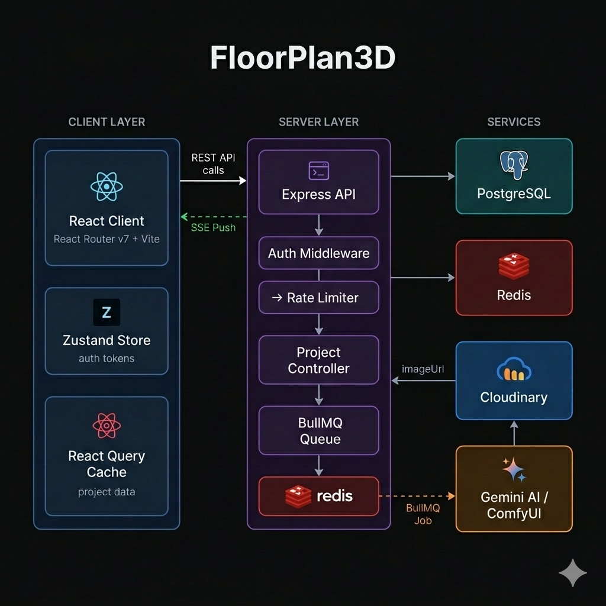
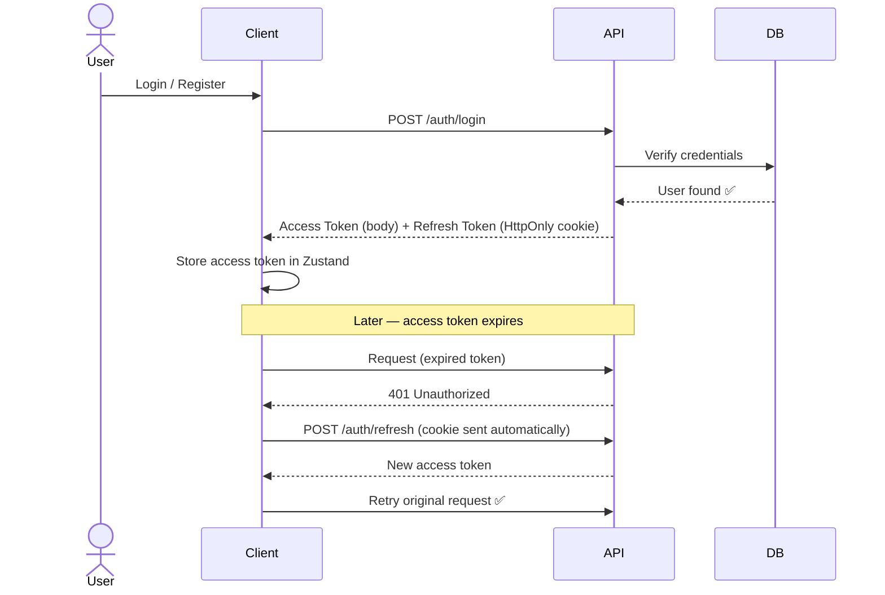
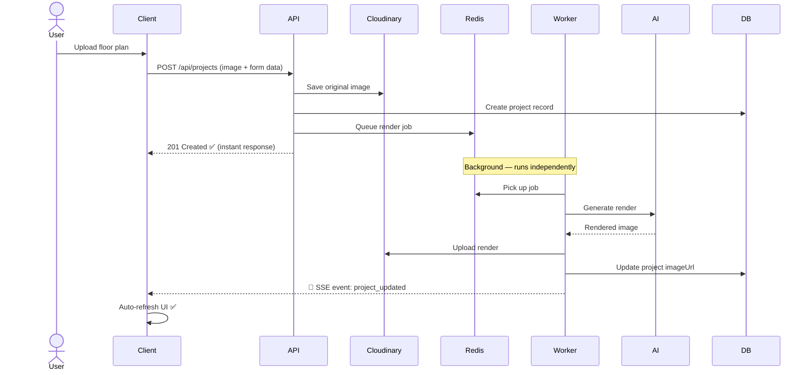

# FloorPlan3D — AI Floor Plan Visualizer

> Transform 2D floor plans into photorealistic 3D architectural renders using AI.


---

## Overview

FloorPlan3D is a full-stack web application that uses AI to convert 2D architectural floor plans into photorealistic top-down 3D renders. Users upload a floor plan image and receive a professional visualization with realistic materials, furniture, and lighting — delivered in real-time via Server-Sent Events.


## DEMO
<video src="https://github.com/user-attachments/assets/a402d2c0-89e2-4e30-929e-d3d3e9c59eaf" controls muted width="630">
</video>

## Architecture



### 1. Authentication



### 2. Project Creation & AI Rendering



**Two AI rendering providers are supported:**

- **ComfyUI** — runs locally on your GPU using FLUX.2-klein. Free, no API limits.
- **Gemini AI** — Google's cloud-based image generation. No GPU required.

---

## Features

- Upload 2D floor plan images (JPG, PNG, WebP, SVG)
- AI-powered photorealistic render generation
- Choose between ComfyUI (local GPU) or Gemini AI (cloud)
- **Real-time render status** via Server-Sent Events (no polling!)
- **Persistent background jobs** via BullMQ + Redis (crash-safe)
- Private and community project visibility
- **Delete project** with Cloudinary image cleanup
- Google OAuth sign-in
- Email verification via Resend
- JWT authentication with automatic token refresh
- Rate limiting on all API endpoints
- User profile management with avatar upload
- Community gallery of shared projects
- Fully responsive UI

---

## Tech Stack

### Frontend
| Technology | Purpose |
|---|---|
| React Router v7 | SPA framework with file-based routing |
| TypeScript | Type safety |
| Tailwind CSS v4 | Styling |
| TanStack Query | Server state management & caching |
| Zustand | Client state management (auth tokens) |
| Axios | HTTP client with interceptors & auto-refresh |
| Sonner | Toast notifications |
| Zod | Client environment variable validation |

### Backend
| Technology | Purpose |
|---|---|
| Node.js + Express | REST API server |
| TypeScript | Type safety |
| Prisma ORM v7 | Database access |
| PostgreSQL | Primary database |
| Redis | BullMQ job queue backing store |
| BullMQ | Persistent background job queue |
| JWT | Authentication (access + refresh tokens) |
| bcryptjs | Password hashing |
| Multer | File upload handling |
| Cloudinary | Image storage & CDN |
| Resend | Transactional emails |
| google-auth-library | Google OAuth token verification |
| Zod | Request & environment variable validation |
| express-rate-limit | API rate limiting |

### AI & Rendering
| Technology | Purpose |
|---|---|
| ComfyUI | Local GPU-based rendering (FLUX.2-klein) |
| Google Gemini API | Cloud-based AI image generation |
| FLUX.2-klein-base-4b-fp8 | Diffusion model |
| qwen_3_4b | CLIP text encoder |

### Infrastructure
| Technology | Purpose |
|---|---|
| Docker + Docker Compose | Containerized development & production |
| Redis (docker) | BullMQ job queue |
| Cloudinary | Image CDN and storage |
| GitHub Actions | CI/CD pipeline |

### Testing & Quality
| Technology | Purpose |
|---|---|
| Vitest | Unit & integration testing |
| React Testing Library | Component testing |
| ESLint | Code linting |
| @typescript-eslint | TypeScript linting |

---

## Project Structure

```
FloorPlan3D/
├── client/                          # React Router 7 frontend
│   ├── app/
│   │   ├── components/              # Reusable UI components
│   │   │   ├── Navbar/
│   │   │   ├── Profile/
│   │   │   ├── project/
│   │   │   │   ├── ProjectCard.tsx
│   │   │   │   └── ProjectCardSkeleton.tsx
│   │   │   ├── ui/
│   │   │   │   ├── ConfirmModal.tsx
│   │   │   │   ├── FullPageLoader.tsx
│   │   │   │   └── ...
│   │   │   └── visualizer/
│   │   │       ├── ComparisonSlider.tsx
│   │   │       └── VisualizerActions.tsx
│   │   ├── hooks/
│   │   │   ├── useAuth.ts
│   │   │   ├── useProject.ts        # Includes useProjectUpdates (SSE)
│   │   │   └── useUser.ts
│   │   ├── routes/
│   │   │   ├── home.tsx
│   │   │   ├── my-projects.tsx
│   │   │   ├── visualizer.tsx
│   │   │   └── ...
│   │   ├── store/
│   │   │   └── authStore.ts         # Zustand auth store
│   │   └── tests/                   # Test files
│   │       ├── components/           # Component tests
│   │       ├── hooks/                # Hook tests
│   │       ├── store/                # Store tests
│   │       └── setup.tsx             # Test setup
│   ├── lib/
│   │   │   └── axios.ts             # Axios instance + interceptors
│   │   ├── env.ts                   # Zod client env validation
│   │   └── root.tsx
│   └── package.json
│
├── server/                          # Express + TypeScript backend
│   ├── src/
│   │   ├── config/
│   │   │   ├── db.ts                # Prisma client
│   │   │   └── env.ts               # Zod server env validation
│   │   ├── controllers/
│   │   │   ├── auth.controller.ts
│   │   │   ├── project.controller.ts
│   │   │   └── user.controller.ts
│   │   ├── jobs/
│   │   │   ├── queue.ts             # BullMQ queue + Redis connection
│   │   │   └── project.processor.ts # BullMQ Worker (AI rendering)
│   │   ├── middlewares/
│   │   │   ├── auth.middleware.ts
│   │   │   ├── authorize.middleware.ts
│   │   │   ├── rateLimit.middleware.ts
│   │   │   ├── validate.middleware.ts
│   │   │   └── upload.middleware.ts
│   │   ├── routes/
│   │   │   ├── auth.routes.ts
│   │   │   ├── project.routes.ts
│   │   │   └── user.routes.ts
│   │   ├── services/
│   │   │   ├── auth.service.ts
│   │   │   ├── project.service.ts
│   │   │   ├── gemini.service.ts
│   │   │   └── comfyui.service.ts
│   │   └── utils/
│   │       ├── ApiError.ts
│   │       ├── ApiResponse.ts
│   │       ├── cloudinary.ts        # Upload + delete helpers
│   │       └── sse.ts               # SSE manager
│   │   └── tests/                   # Test files
│   │       ├── unit/                 # Unit tests
│   │       ├── integration/          # Integration tests
│   │       └── setup.ts             # Test setup
│   ├── prisma/
│   │   └── schema.prisma
│   └── package.json
│
├── docs/
│   └── architecture.png             # Architecture diagram
├── .github/
│   └── workflows/
│       └── test.yml                # CI/CD pipeline
├── docker-compose.yml
├── docker-compose.dev.yml
└── .env.example
```

---

## Getting Started

### Prerequisites

- Node.js 20+
- Docker + Docker Compose
- NVIDIA GPU with 8GB+ VRAM (for ComfyUI)
- ComfyUI installed locally (for local rendering)

### 1. Clone the repository

```bash
git clone https://github.com/Rai-Anish/FloorPlan3D.git
cd FloorPlan3D
```

### 2. Configure environment variables

```bash
cp .env.example .env
```

Open `.env` and fill in all required values (see [Environment Variables](#environment-variables)).

### 3. Set up ComfyUI models (optional — for local GPU rendering)

Download the following models into your ComfyUI installation:

| Model | Path |
|---|---|
| `flux-2-klein-base-4b-fp8.safetensors` | `models/diffusion_models/` |
| `qwen_3_4b.safetensors` | `models/text_encoders/` |
| `flux2-vae.safetensors` | `models/vae/` |

Start ComfyUI:
```bash
python main.py --listen 0.0.0.0 --port 8188
```

### 4. Start the development environment

```bash
docker-compose -f docker-compose.dev.yml up -d
```

This starts PostgreSQL, Redis, the Express server, and the Vite client.

### 5. Run database migrations

```bash
docker-compose -f docker-compose.dev.yml exec server npx prisma migrate dev
```

### 6. Open the app

| Service | URL |
|---|---|
| Client | http://localhost:5173 |
| Server API | http://localhost:5000 |
| Prisma Studio | http://localhost:5555 |
| ComfyUI | http://localhost:8188 |

---

## Testing

### Run Tests

```bash
# Client tests
cd client && npm test

# Server tests
cd server && npm test

# Run tests once (CI mode)
cd client && npm run test:run
cd server && npm run test:run
```

### Run Linting

```bash
# Client lint
cd client && npm run lint

# Server lint
cd server && npm run lint

# Auto-fix linting issues
cd client && npm run lint:fix
cd server && npm run lint:fix
```

### Test Coverage

```bash
# Generate coverage report
cd client && npm run test:coverage
cd server && npm run test:coverage
```

### CI/CD

GitHub Actions runs on every push and PR:
- **Lint jobs** — ESLint checks for client and server
- **Test jobs** — Vitest unit & integration tests
- **Coverage jobs** — Generate coverage reports

---

## Environment Variables

Create a `.env` file in the root directory. See `.env.example` for all variables.

```env
# Database
POSTGRES_USER=FloorPlan3D
POSTGRES_PASSWORD=password
POSTGRES_DB=FloorPlan3D_db
DATABASE_URL=postgresql://FloorPlan3D:password@db:5432/FloorPlan3D_db

# Redis (auto-configured via Docker)
REDIS_URL=redis://redis:6379

# JWT
JWT_ACCESS_SECRET=
JWT_REFRESH_SECRET=
JWT_ACCESS_EXPIRES_IN=15m
JWT_REFRESH_EXPIRES_IN=7d

# Email (Resend)
RESEND_API_KEY=
FROM_EMAIL=onboarding@resend.dev

# Client
CLIENT_URL=http://localhost:5173
VITE_SERVER_URL=http://localhost:5000/api
VITE_GOOGLE_CLIENT_ID=

# Cloudinary
CLOUDINARY_CLOUD_NAME=
CLOUDINARY_API_KEY=
CLOUDINARY_API_SECRET=

# Google OAuth
GOOGLE_CLIENT_ID=
GOOGLE_CLIENT_SECRET=
GOOGLE_CALLBACK_URL=http://localhost:5000/api/auth/google/callback

# AI Providers
GEMINI_API_KEY=
COMFYUI_URL=http://host.docker.internal:8188
```

---

## API Reference

### Authentication

| Method | Endpoint | Auth | Description |
|---|---|---|---|
| `POST` | `/api/auth/register` | — | Register new user |
| `POST` | `/api/auth/login` | — | Login |
| `GET` | `/api/auth/verify-email` | — | Verify email token |
| `POST` | `/api/auth/resend-verification` | — | Resend verification email |
| `POST` | `/api/auth/refresh` | Cookie | Refresh access token |
| `POST` | `/api/auth/logout` | — | Logout |
| `GET` | `/api/auth/me` | Bearer | Get current user |
| `GET` | `/api/auth/google` | — | Google OAuth redirect |
| `GET` | `/api/auth/google/callback` | — | Google OAuth callback |
| `POST` | `/api/auth/google/token` | — | Google GSI token verify |

### Projects

| Method | Endpoint | Auth | Description |
|---|---|---|---|
| `GET` | `/api/projects/community` | — | Get community projects |
| `GET` | `/api/projects/my` | Bearer | Get my projects |
| `GET` | `/api/projects/stream` | Bearer | SSE stream for live render updates |
| `GET` | `/api/projects/:id` | Optional | Get project by ID |
| `POST` | `/api/projects` | Bearer | Create project & queue render |
| `PUT` | `/api/projects/:id` | Bearer | Update project (owner only) |
| `DELETE` | `/api/projects/:id` | Bearer | Delete project + Cloudinary cleanup |

### User

| Method | Endpoint | Auth | Description |
|---|---|---|---|
| `GET` | `/api/user/me` | Bearer | Get profile + stats |
| `PUT` | `/api/user/me` | Bearer | Update profile + avatar |
| `PUT` | `/api/user/me/password` | Bearer | Change password |
| `DELETE` | `/api/user/me` | Bearer | Delete account |

---

## How Rendering Works

```
User uploads floor plan
        ↓
Express saves original image to Cloudinary
        ↓
Creates project record (imageUrl: "")
        ↓
Adds job to BullMQ queue → returns 201 immediately ✅
        ↓
BullMQ Worker picks up job (background)
        ↓
┌─────────────────────┐    ┌────────────────────────┐
│   ComfyUI Provider  │ OR │   Gemini AI Provider    │
│                     │    │                         │
│ 1. Upload to ComfyUI│    │ 1. Convert to base64    │
│ 2. Queue workflow   │    │ 2. Send to Gemini API   │
│ 3. Wait for result  │    │ 3. Extract image        │
└─────────────────────┘    └────────────────────────┘
        ↓
Upload rendered image to Cloudinary
        ↓
Update project.imageUrl in database
        ↓
Push SSE event → "project_updated" → client
        ↓
React Query invalidates cache → UI auto-refreshes ✅
```

---

## Security

| Layer | Implementation |
|---|---|
| **Rate Limiting** | Global: 100 req/15 min · Auth routes: 10 req/hour |
| **Authentication** | JWT access token (15m) + HttpOnly refresh cookie (7d) |
| **Authorization** | Ownership check on all project mutations (IDOR protection) |
| **Environment Validation** | Zod schema validation on server startup and Vite client boot |
| **Password Hashing** | bcryptjs |
| **Input Validation** | Zod schemas on all API request bodies |

---

## ComfyUI Workflow

The project uses the **FLUX.2-klein image edit workflow** which takes a reference image (the floor plan) and generates a photorealistic architectural render.

**Workflow nodes used:**
- `UNETLoader` — loads FLUX.2-klein diffusion model
- `CLIPLoader` — loads Qwen 3 4B text encoder
- `VAELoader` — loads FLUX2 VAE
- `VAEEncode` → `ReferenceLatent` — encodes floor plan as reference
- `CLIPTextEncode` — encodes architectural prompt
- `CFGGuider` + `SamplerCustomAdvanced` — sampling pipeline
- `VAEDecode` → `SaveImage` — decodes and saves output

**Recommended GPU:** RTX 3060 or higher (8GB+ VRAM)
<details>
<summary><b>View ComfyUI Workflow Details</b></summary>

> [!NOTE]
> You can find the ComfyUI workflow JSON at: `docs/workflow.json`.
>
> To use it:
> 1. Open ComfyUI.
> 2. Drag and drop the `.json` file from the `/docs` folder directly into the browser.
</details>


---

## Docker Setup

### Development
```bash
# start all services (postgres, redis, server, client) with hot reload
docker-compose -f docker-compose.dev.yml up -d

# view logs
docker-compose -f docker-compose.dev.yml logs -f server

# run migrations
docker-compose -f docker-compose.dev.yml exec server npx prisma migrate dev --name your_migration

# open prisma studio
docker-compose -f docker-compose.dev.yml exec server npx prisma studio
```

### Production
```bash
docker-compose up -d
```

---

## License

This project is licensed under the MIT License. See [LICENSE](LICENSE) for details.

---

## Acknowledgements

- [ComfyUI](https://github.com/comfyanonymous/ComfyUI) — local AI inference
- [FLUX.2-klein](https://huggingface.co/black-forest-labs) — diffusion model by Black Forest Labs
- [Google Gemini](https://ai.google.dev) — cloud AI image generation
- [BullMQ](https://docs.bullmq.io) — Redis-based job queue
- [Prisma](https://prisma.io) — next-generation ORM
- [TanStack Query](https://tanstack.com/query) — powerful data fetching

---

<p align="center">Built by Anish Rai</p>
